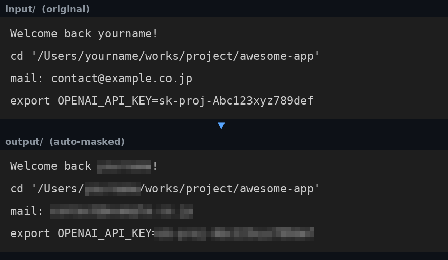

<div align="center">

# mosaic-names

**スクリーンショットの「見せたくない文字列」だけを、OCR で見つけて自動モザイク。**

ユーザー名・本名・メールアドレス・API キー。ターミナルやエディタのスクショに
写り込むそれらを、公開前にコマンド一発で塗りつぶすローカル完結ツールです。

[](https://www.python.org/)
[](#-仕組み)
[](#-仕組み)
[](#-特徴)



</div>

---

## ✨ 特徴

- 🎯 **自分で決めた文字列だけを隠す** — 汎用の個人情報検出はしない。`mosaic-names.txt` に書いた文字列(と正規表現)だけが対象。誤爆しない
- 🔍 **OCR の誤読に強い** — `0/O`・`1/l/I` の混同や、トークン途中への空白の誤挿入(`sk-proj -Abc...`)があっても検出する
- 🔑 **メールアドレス・API キーは正規表現で** — `re:` 行でパターン指定。メール全般と `sk-` 系キーは既定で同梱
- 📁 **input/ → output/ の安全設計** — 元ファイルには一切書き込まない。検出ゼロの画像もコピーされるので output/ がそのまま公開セットになる
- 🍎 **macOS は追加モデル不要** — 標準の Vision framework で日本語 OCR。画像はどこにも送信されない(完全ローカル)
- 🧩 **単一ファイルのスクリプト** — 依存は Pillow + (macOS なら pyobjc)。アプリでもサービスでもなく、読める量のPython

## 🚀 クイックスタート

```bash
git clone https://github.com/zephel01/mosaic-names.git
cd mosaic-names
./setup.sh        # venv・依存・設定ファイル・input/ output/ を全部用意(冪等)
```

あとは3手:

```bash
vim mosaic-names.txt   # 1. 隠したい文字列を書く(サンプルから作成済み)
open input/            # 2. スクリーンショットを input/ に置く
./mosaic               # 3. 一括処理 → output/ に公開用セットが出来る
```

処理前に検出箇所だけ確認したいときは:

```bash
./mosaic --list
```

## 📝 隠す文字列の書き方(mosaic-names.txt)

1行1エントリ。`#` はコメント。大文字小文字は区別せず、行内の部分一致でも
その部分だけがモザイク化されます。

```
# 固定文字列(自分のものに置き換える)
yourname
Your Full Name
your-machine-name

# `re:` で始まる行は正規表現(大文字小文字無視)
re:[a-z0-9._%+-]+@[a-z0-9.-]+\.[a-z]{2,}   # メールアドレス全般
re:\bsk-[a-z0-9_-]{8,}                     # sk- 系 API キー(OpenAI / Anthropic)
```

トークン形式は同じ要領で追加できます:

```
re:\bghp_[a-z0-9]{20,}          # GitHub personal access token
re:\bxox[bpars]-[a-z0-9-]{10,}  # Slack token
re:\bAKIA[0-9A-Z]{16}           # AWS access key ID
```

> **Note**
> 実際の `mosaic-names.txt` は個人情報そのものなので `.gitignore` 済み。
> リポジトリに入るのはサンプル(`mosaic-names.example.txt`)だけです。

## 📁 ワークフロー

```
input/    ← スクショを置く(このフォルダは読み取りのみ。絶対に変更されない)
  ↓  ./mosaic
output/   ← マスク済みが元ファイル名で出力。検出ゼロの画像もコピーされる
```

`input/`・`output/`・`photo/` は `.gitignore` 済みなので、マスク前の原本を
うっかりコミットする事故も防げます。

個別のファイルやフォルダを指定した処理も可能です:

```bash
./mosaic screenshot.png                  # 単発 → screenshot.masked.png
./mosaic shots/ --out-dir publish        # 任意フォルダを一括 → publish/ へ
./mosaic img.png -n "この文字列も追加で"   # リストに一時追加
```

## 🔧 オプション

| オプション | 説明 |
|---|---|
| `--list` | 検出位置を表示するだけ。ファイルは書き込まない |
| `--out-dir DIR` | 出力先ディレクトリ(元ファイル名のまま集約) |
| `--skip-existing` | 出力が既にあればスキップ(中断した一括処理の再開) |
| `-n TEXT` | 隠す文字列を一時追加(複数可。`re:` プレフィックスも可) |
| `--names-file FILE` | リストファイルを差し替え |
| `--pad N` | モザイク領域の余白 px(既定 3) |
| `--backend B` | `auto` / `vision` / `tesseract` / `easyocr` |
| `--in-place` | 元ファイルを上書き(通常は不要) |

## 🧠 仕組み

1. **OCR** — 画像内の全テキストと座標を取得
   - macOS: **Apple Vision framework**(既定。モデルダウンロード不要・日本語対応・完全ローカル)
   - その他: **Tesseract** → **EasyOCR** の順に自動フォールバック
2. **照合** — 認識テキストをリストと突き合わせ
   - 固定文字列: 小文字化 + `0/O`・`1/l/I` 同一視 + 空白除去で、OCR 誤読に耐性
   - 正規表現: 元テキストと空白除去テキストの両方に適用(トークン分断対策)
3. **モザイク** — 一致した部分文字列の矩形だけをピクセル化(縮小→ニアレスト拡大の不可逆処理)

Vision バックエンドでは部分文字列の正確な矩形を API から取得し、その他の
バックエンドでは単語ボックスから文字位置比で近似します。

## ⚠️ 注意

- OCR ベースのため、極端に小さい文字・低コントラスト・装飾フォントは
  取りこぼすことがあります。**公開前に `--list` と目視での最終確認を推奨**
- モザイクは不可逆ですが、巨大な文字に薄くかかった場合の復元耐性までは
  保証しません。不安なら `--pad` を増やしてください
- 対応画像形式: PNG / JPEG / WebP / TIFF / BMP(HEIC は `pillow-heif` 追加で対応可)

## セットアップを手動でやる場合

```bash
python3 -m venv .venv && source .venv/bin/activate
pip install -r requirements.txt
cp mosaic-names.example.txt mosaic-names.txt
python3 mosaic_names.py --help
```
